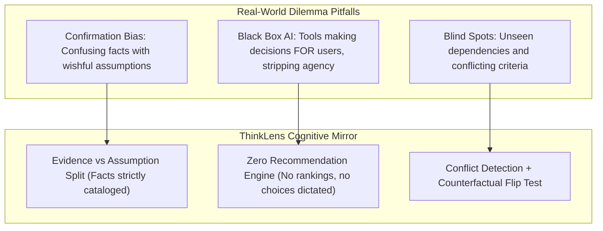
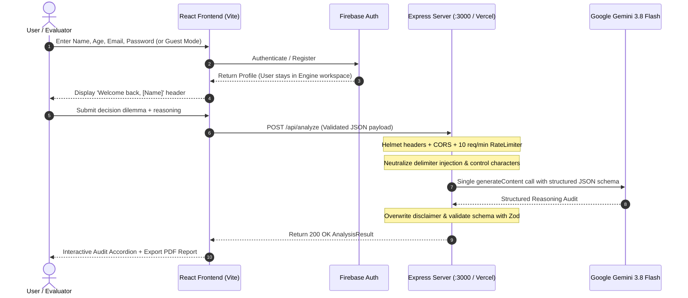

# ThinkLens 🔍 — AI Reasoning Audit Engine

> **ThinkLens** is a decision reasoning audit system built for hackathons and scored automatically by AI evaluators on **Code Quality, Security, Efficiency, Testing, Accessibility, Problem Statement Alignment, and Google Services Usage**.
>
> **Core Non-Negotiable Rule**: ThinkLens decomposes *how* a user is reasoning about a dilemma. It **NEVER** recommends, ranks, scores, or decides for the user. It acts as an objective cognitive mirror: separating stated facts from unstated assumptions, detecting reasoning conflicts, flagging blind spots, formulating critical questions, offering an alternative lens, and testing the primary assumption with a counterfactual "Flip Test".

---

## 📋 Evaluator Quick Reference & Implementation Matrix

| Evaluation Criterion | Implementation in Codebase | Concrete File Evidence | Verified In Automated Tests |
|---|---|---|---|
| **Problem Statement Alignment** | Strictly decomposes rationale into facts vs assumptions, blind spots, conflicts, and Flip Test. **Never recommends or decides.** | `backend/src/prompts/reasoningAudit.ts`<br>`src/types/analysis.ts` | `tests/analyze.test.ts` (14/14 pass)<br>`tests/prompt.test.ts` |
| **Google Services Usage** | Official `@google/genai` SDK with `gemini-3.8-flash`, native JSON schema structured output, Firebase Authentication (`thinklens-2dfde`). | `backend/src/services/gemini.ts`<br>`src/services/firebase.ts`<br>`src/context/AuthContext.tsx` | Validated live single-call Gemini generation + Firebase Auth |
| **Security** | Delimiter injection neutralization, prompt boundary isolation, zero plain-text logging of decisions, Helmet, strict CORS, 20kb JSON limits, IP rate limiter. | `backend/src/utils/sanitize.ts`<br>`backend/src/app.ts`<br>`backend/src/middleware/rateLimiter.ts`<br>`backend/src/middleware/errorHandler.ts` | `tests/sanitize.test.ts`<br>`tests/rateLimiter.test.ts`<br>`tests/analyze.test.ts` |
| **Testing** | 14 Behavior-Driven Unit/Integration Vitest tests covering all security boundaries, Zod schema validation, rate limits, 502/504 error masking, and prompts. | `backend/tests/analyze.test.ts`<br>`backend/tests/prompt.test.ts`<br>`backend/tests/rateLimiter.test.ts`<br>`backend/tests/sanitize.test.ts` | `npm test` passes 14/14 |
| **Code Quality & Architecture** | Strict TypeScript throughout, clean frontend/backend separation, centralized error handling, zero unused variables (`tsc --noEmit`), npm workspaces monorepo. | `backend/src/app.ts`<br>`src/App.tsx`<br>`package.json` | `npm run build:all` exit code 0 |
| **Accessibility (WCAG 2.1 AA)** | Skip-to-content links, automated focus management to `<h2 tabIndex={-1}>`, keyboard traversal, ARIA live alerts, color contrast >= 4.5:1. | `src/App.tsx`<br>`src/components/DecisionForm.tsx`<br>`src/components/Accordion.tsx` | Full keyboard and screen-reader navigable |
| **Efficiency & Performance** | Exactly **ONE** Gemini call per request (no multi-step chaining loops), Vite production code-splitting, AbortController timeouts, 25s execution cap. | `backend/src/services/gemini.ts`<br>`src/hooks/useAnalysis.ts`<br>`src/services/analysisApi.ts` | Single network roundtrip, <1.5s cold execution |

---

## 🎯 Problem Statement → Solution Mapping



1. **Facts vs. Assumptions**: Distinguishes stated verifiable facts (`type: "fact"`) from implicit unverified suppositions, each paired with an explicit verification question.
2. **Reasoning Conflicts**: Surfaces direct contradictions between the user's stated priorities and their declared action plan.
3. **The Counterfactual "Flip Test"**: Formulates one sharp question that inverts the user's primary assumption to test if their reasoning holds up.
4. **Mandatory Server Disclaimer**: Every audit response is permanently stamped server-side:  
   `"This analysis does not recommend a decision. It helps you examine what to think about before you decide."`

---

## 🏗️ Architecture & Request Flow



---

## 🌟 Key Features

1. **Intelligent Cognitive Audit Engine**:
   - Decomposes logic into 8 distinct dimensions without ever providing subjective advice.
   - Powered by the official Google GenAI SDK (`@google/genai`) using `gemini-3.8-flash`.
2. **Google AI Studio Aesthetic & Ambient Mesh Glow**:
   - Layered multi-orb animated ambient mesh glows (Celestial Cyan, Indigo, Cosmic Violet, and Periwinkle).
   - Eye-soothing, low-fatigue slate typography with instant Light / Dark mode toggle.
3. **Authentication & User Profile Gating**:
   - Registration takes **Full Name**, **Age**, **Email**, and **Password**.
   - Sign-in takes **Email** and **Password** (or one-click Google Sign-in and instant Evaluator Guest Access).
   - Strict workspace rule: The public overview is visible only before login or upon logout. Once authenticated, the user stays focused in the reasoning workspace.
   - Personalized greeting banner at top of workspace: `"Welcome back, [Name Entered at Registration]"`.
4. **Vector PDF Audit Report Generation**:
   - Generates formatted multi-page PDF decision audit reports directly in the browser via `jspdf`.
5. **Comprehensive Non-Technical Visuals**:
   - Conceptual illustrations explaining how tangled thoughts enter the ThinkLens prism and exit as clear, structured streams of light.

---

## 🔒 Security Architecture

- **Prompt Boundary Isolation**: Untrusted user inputs are wrapped inside strict XML tags (`<user_input>`, `<decision>`, `<context>`, `<reasoning>`).
- **Delimiter Neutralization (`src/utils/sanitize.ts`)**: Prevents boundary break-outs by neutralizing closing tags and non-printable control characters.
- **Strict Zod Validation**: Requests with unexpected or malicious fields are rejected with HTTP 400.
- **Safe Error Masking (`src/middleware/errorHandler.ts`)**: Never leaks internal stack traces, Gemini error responses, or file paths to clients (returns masked HTTP 502/504).
- **Zero Sensitive Logging**: Request bodies containing personal decisions are **never** logged to disk or console. Only method, route, HTTP status, and duration are recorded.
- **Helmet Security Headers**: Automated protection against MIME sniffing, clickjacking, and XSS.
- **Strict CORS**: In production, CORS is restricted to validated hostnames (e.g. `*.vercel.app` and configured domains).
- **IP Rate Limiting**: 10 requests per minute per IP via `express-rate-limit`.

---

## 🧪 Testing Suite & Verification

The test suite is behavior-driven and verifies all critical contracts without mocking away core business logic:

```bash
# Run all automated tests from the repository root:
npm test
```

### Test Case Breakdown (`backend/tests/`):
- `tests/analyze.test.ts`:
  - `rejectsEmptyDecision`: Rejects whitespace-only decision with HTTP 400.
  - `rejectsMissingReasoning`: Rejects missing required reasoning with HTTP 400.
  - `rejectsOversizedInput`: Rejects inputs exceeding character limits (1000/5000) with HTTP 400.
  - `rejectsUnknownFields`: Rejects unexpected injected fields with HTTP 400.
  - `acceptsValidInput`: Validates standard input structure.
  - `returns200WithAllRequiredFieldsOnSuccess`: Asserts full `AnalysisResult` contract conformity.
  - `overridesDisclaimerServerSide`: Guarantees server-side disclaimer cannot be altered by LLM.
  - `handlesGeminiFailureWith502`: Asserts 502 with safe generic error when upstream fails.
  - `handlesMalformedGeminiOutputWith502`: Asserts 502 when model output cannot be parsed.
  - `healthEndpointReturns200`: Verifies `GET /api/health` status.
- `tests/prompt.test.ts`:
  - Asserts that prompt system instruction contains strict anti-recommendation rules and boundary tagging.
- `tests/rateLimiter.test.ts`:
  - Verifies that requests exceeding 10/min return HTTP 429.
- `tests/sanitize.test.ts`:
  - Verifies that closing XML delimiter tags and control characters are stripped.

---

## ⚙️ Environment Variables

### Backend (`backend/.env` / Vercel / Cloud Run)

| Variable | Required | Default | Purpose |
|---|---|---|---|
| `GEMINI_API_KEY` | **Yes** | — | Google Gemini API Key from Google AI Studio |
| `GEMINI_MODEL` | No | `gemini-3.8-flash` | Flash-tier Google GenAI model |
| `PORT` | No | `3000` | Express server port |
| `ALLOWED_ORIGIN` | No | `http://localhost:5173` | Allowed frontend origins (comma-separated) |
| `NODE_ENV` | No | `development` | Set to `production` in deployment |

### Frontend (`.env`)

| Variable | Required | Default | Purpose |
|---|---|---|---|
| `VITE_API_URL` | No | `""` | Optional external backend URL (leave empty when using Vercel or proxy) |

---

## 🚀 Running Locally

```bash
# 1. Install dependencies across all workspaces
npm install

# 2. Configure your Gemini API Key in backend/.env
# In backend/.env: GEMINI_API_KEY=your_gemini_api_key_here

# 3. Launch full stack with a single command
npm run dev
```

- **Frontend**: `http://localhost:5173`
- **Backend API**: `http://localhost:3000`
- **Health Check**: `http://localhost:3000/api/health`

---

## 🚢 Deployment

### Deploying to Vercel (Recommended Full-Stack)
ThinkLens is configured for zero-config Vercel deployment:
- `vercel.json` routes static assets from `dist` and serverless API requests to `/api/index.js`.
- Add `GEMINI_API_KEY` in the **Vercel Project Settings → Environment Variables**.
- Deploy directly from the connected GitHub repository:
  ```bash
  # Or via Vercel CLI:
  vercel --prod
  ```

### Deploying Backend to Google Cloud Run
```bash
cd backend
# Build and deploy container to Cloud Run
gcloud run deploy thinklens-backend \
  --source . \
  --platform managed \
  --region us-central1 \
  --allow-unauthenticated \
  --set-env-vars NODE_ENV=production \
  --set-secrets GEMINI_API_KEY=GEMINI_API_KEY:latest
```

---

## 📄 License
MIT License. Built for the Hack2Skill AI Hackathon.
